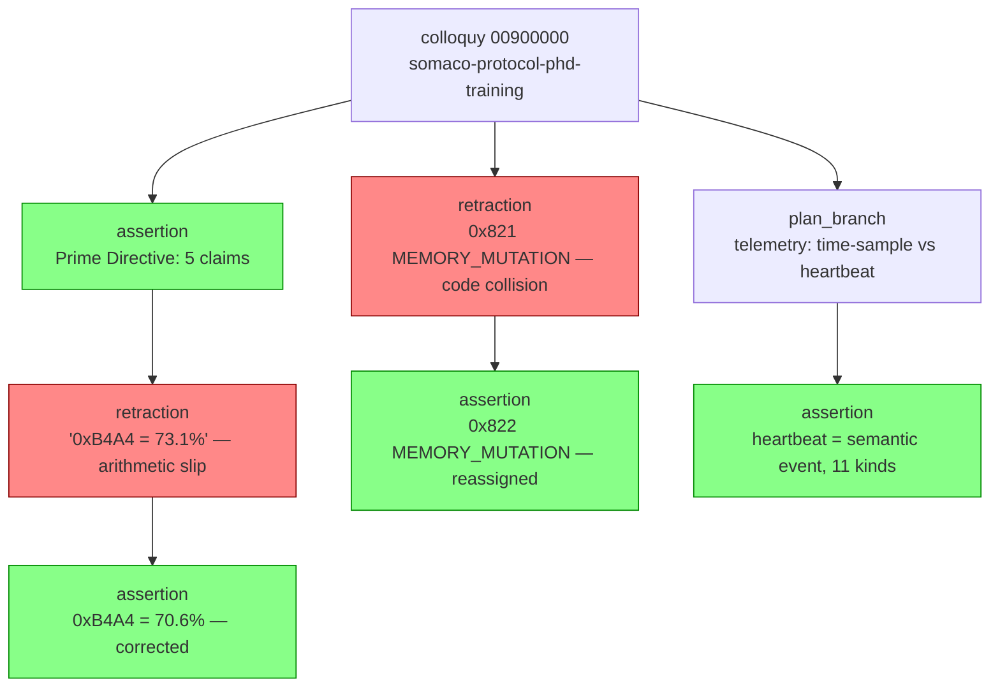

<!-- =============================================================================== file_id: SOM-DOC-7696-v1.0.0 name: first-colloquy.md description:  project_id: OLIGARCHOLOGY category: doc tags: [] created: 2026-06-08 modified: 2026-06-08 version: 1.0.0 agent_id: AGENT-PRIME-002 =============================================================================== -->

<!-- =============================================================================== file_id: SOM-DOC-7696-v1.0.0 name: first-colloquy.md description:  project_id: OLIGARCHOLOGY category: doc tags: [] created: 2026-06-08 modified: 2026-06-08 version: 1.0.0 agent_id: AGENT-PRIME-002 =============================================================================== -->

---
file_id: SOM-DOC-0051-v0.1.0
name: first-colloquy.md
description: Retro-mint of the 2026-04-21 PhD-Trainer × Vertex teaching
  session as the canonical first colloquy. Demonstrates what a
  heartbeat-mode colloquy looks like when reconstructed from a pre-skill
  chat — the artifact the skill is modeled after.
category: DOC
tags: [colloquy, example, retro-mint, vertex, training, somaco-protocol]
created: 2026-04-22
modified: 2026-04-22
version: 0.1.0
agent_id: claude-sonnet-4-5
---

# First Colloquy — 2026-04-21 Somaco Protocol PhD Training

This is a **retro-mint**: the session ran under ad-hoc session UUID
`cf5184f9-6407-435e-adba-3dcffa8fed75` before the colloquy skill existed.
Rebuilt here as a proper colloquy to seed the vault and to show what the
skill produces end-to-end.

## Colloquy header

```yaml
colloquy_uuid:       00900000-e2a4-018b-8c40-000000000001  # retro-minted, scheme_v=0
initiator:           somaco (agent_uuid=0002-…, domain=0x2, provenance=0x1)
parties:
  - somaco           (role: trainer, human)
  - vertex           (role: student, claude-sonnet-4-5 @ 100.106.72.94)
skill:               somaco-protocol-phd-training
invocation_mode:     explicit
telemetry_mode:      heartbeat
minted_at:           2026-04-21T09:00:00-07:00
closed_at:           2026-04-21T14:30:00-07:00
turn_count:          7
status:              CLOSED
total_input_tokens:  ~88 400
total_output_tokens: ~12 700
cache_hit_ratio:     0.847   # 6145-tok codebook prefix held warm across 7 turns
```

## Agent sessions

| Party  | agent_session_uuid                        | Derived from                           |
|--------|-------------------------------------------|----------------------------------------|
| somaco | `00a00000-e2a4-018b-8c40-000000000001-s1` | fnv1a12("somaco" ‖ colloquy_uuid)      |
| vertex | `00a00000-e2a4-018b-8c40-000000000001-s2` | fnv1a12("vertex" ‖ colloquy_uuid)      |

(Shown abbreviated; real derivation via `deriveAgentSessionUUID()`.)

## Turns

| # | turn_uuid (short) | topic                              | tokens_in | tokens_out | heartbeats |
|---|-------------------|------------------------------------|-----------|------------|------------|
| 0 | `0050-a1f2`       | Baseline elicitation               | 6 400     | 1 100      | 3          |
| 1 | `0050-b2e3`       | Prime Directive formalization      | 11 200    | 1 800      | 5          |
| 2 | `0050-c3d4`       | GYST bit layout (with num fix)     | 12 800    | 2 100      | 7          |
| 3 | `0050-d4c5`       | Type registry + 0x822 reassign     | 13 100    | 2 000      | 6          |
| 4 | `0050-e5b6`       | Provenance + signal confidence     | 12 400    | 1 700      | 5          |
| 5 | `0050-f6a7`       | Cache economics (5-min TTL math)   | 14 300    | 1 900      | 8          |
| 6 | `0050-a7b8`       | Colloquy skill co-design           | 18 200    | 2 100      | 12         |

Total heartbeats: **46**.

## Decision-tree highlights



Two retractions preserved as learning evidence:

1. **Arithmetic slip** (turn 2) — Vertex computed `0xB4A4/65535 = 0.731`;
   actual `46244/65535 = 0.7056`. Retracted + corrected same turn. This is
   the kind of heartbeat pair that makes a great fine-tune example: the
   model *noticed and corrected itself* with full causal trace intact.

2. **Type code collision** (turn 3) — proposed `0x821 MEMORY_MUTATION`
   moments after assigning `0x821 AGENT_TURN`. Retracted, reassigned to
   `0x822`. Registry discipline encoded as a walkable lesson.

## What this colloquy produced

- 7 training docs in `docs/vertex-training/` (SOM-DOC-0042 … 0048 etc.)
- The entire `colloquy` skill (SKILL.md + 5 references + schema + 5 scripts)
- Codebook v2.2.0 → v2.4.0 patch (§12-§15, +4 type codes)
- This very example doc

## Why retro-mint matters

A colloquy minted after the fact can never have full heartbeat fidelity —
we reconstructed from memory and transcripts, not from live instrumentation.
The signal numbers above are estimates. But the **shape** is faithful:
turns, parties, retractions, the decision points.

The *next* training colloquy (the one that trains Vertex on this skill)
will be born under the skill — every heartbeat instrumented live, every
confidence reading real, the tree walkable bit-for-bit. That one is the
true first colloquy. This is the prehistory.

## Vault location

`~/vertex-vault/colloquies/2026-04-21-somaco-protocol-phd-training-00900000.md`
(retro-minted; backfilled from `docs/vertex-training/*.md`).
