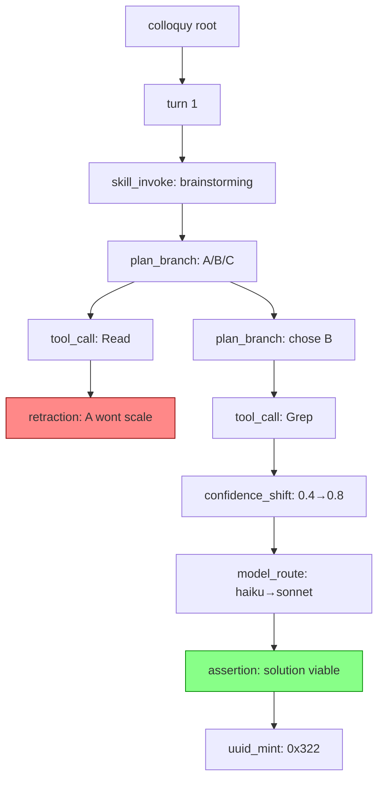

<!-- =============================================================================== file_id: SOM-DOC-4645-v1.0.0 name: decision-tree.md description:  project_id: OLIGARCHOLOGY category: doc tags: [] created: 2026-06-08 modified: 2026-06-08 version: 1.0.0 agent_id: AGENT-PRIME-002 =============================================================================== -->

<!-- =============================================================================== file_id: SOM-DOC-4645-v1.0.0 name: decision-tree.md description:  project_id: OLIGARCHOLOGY category: doc tags: [] created: 2026-06-08 modified: 2026-06-08 version: 1.0.0 agent_id: AGENT-PRIME-002 =============================================================================== -->

---
file_id: SOM-DOC-0048-v0.1.0
name: decision-tree.md
description: Colloquy decision tree spec — the DAG formed by heartbeat
  parent_heartbeat_uuid linkage. Walk/replay/fork semantics, recursive
  CTEs, Mermaid rendering spec, counterfactual fork protocol.
category: DOC
tags: [colloquy, heartbeat, dag, tree, fork, replay, mermaid]
created: 2026-04-22
modified: 2026-04-22
version: 0.1.0
agent_id: claude-sonnet-4-5
---

# The Colloquy Decision Tree

## What It Is

Every heartbeat has a `parent_heartbeat_uuid` field. The sequence of
heartbeats within a colloquy forms a **Directed Acyclic Graph** (DAG):

- **Nodes** are heartbeats (each a `0x825` self-addressing UUID)
- **Edges** are the parent relationships
- **Root** is the colloquy UUID itself (synthetic parent of first heartbeat)
- **Leaves** are terminal decisions (often `uuid_mint` or `assertion`)

The DAG is not a pure tree — a `parallel_merge` heartbeat can have
multiple parents (one from each subagent branch). Hence "DAG" not "tree"
in the strict sense. But conversationally, "decision tree" is the right
mental model.

## Tree Coordinates Encoded in UUIDs

Because heartbeat UUIDs carry `depth(4)` + `generation(4)` in their bit
layout, you can partially walk the tree *without DB access*:

```
decodeGYST(heartbeat_uuid).depth       // 0 = root-child, 15 = max
decodeGYST(heartbeat_uuid).generation  // 0 = scheme_v=0, 1 = scheme_v=1
```

Fork index moved out of the UUID (it lived in `generation` under the
original draft). `generation` now carries the **scheme version** for the
heartbeat UUID's tail 42 bits. Fork index lives in `payload_json.fork_index`
and is reconstructible from `parent_heartbeat_uuid` walk.

## UUID-Embedded Live Telemetry (scheme_v=1)

Heartbeats minted after 2026-04-22 carry **live performance telemetry
inside the UUID bits themselves**. The 42 bits that would have been pure
entropy are repurposed:

```
[ type(12) | ns(12) | ts(24) | v(4) | depth(4) | dom(4) | gen=1(4) | var(2) | prov(4) | signal(16) | tokens_q(16) | savings_q(10) | rand(16) ]
                                                                                                      ← 42 reclaimed bits →
```

- `tokens_q(16)` — accumulated colloquy tokens. Linear 0..65 535, then
  log-exponential: `floor(log2(tokens) * 4096)`. Round-trips exactly up
  to ~65 k, 2% precision above.
- `savings_q(10)` — `cache_hit_ratio × 1023`. 0.1% resolution over [0,1].
- `rand(16)` — collision entropy. UNIQUE(turn_uuid, sequence_in_turn)
  catches rare collisions at insert.

**Why this is free:** the row still carries `tokens_accumulated` and
`cache_hit_ratio_snapshot` columns as truth. The UUID bits are a **fast
read** — scan heartbeat PKs directly, no row lookup, no JOIN, to answer
questions like:

> *"What's the median cache-hit ratio across every heartbeat we emitted
> in the last 10 000 colloquies?"*

That becomes a substring extraction over the `heartbeat_uuid` column — no
table scan, no aggregation join. Zero-cost live health dashboard.

**Tamper-evident:** if `cache_hit_ratio_snapshot` disagrees with the
value decoded from UUID bits, a row was rewritten. Free integrity check,
especially valuable for audit-mode colloquies.

**Collision budget:** 16 entropy bits × UNIQUE(turn, seq) × per-turn
scope means practical collisions approach zero. Timestamp already
disambiguates across seconds. Collisions only possible *within a single
second of the same turn* with identical payload hash — and the seed
includes `Date.now()` at ms resolution, so even that is constrained.

**Versioning:** `generation=0x1` marks scheme_v=1. The library's
`decodeHeartbeat()` dispatches on this field; scheme_v=0 UUIDs (retro-
minted or pre-upgrade) decode as pure-entropy random(42) without issue.
Up to 15 more scheme revisions available via `generation`.

This means:
- Two heartbeats at the same `depth` share a conceptual level.
- Two heartbeats at different `generation` at the same `depth` came from
  different forks of the same plan_branch.
- The `timestamp` field orders them absolutely.

**Limitation:** you can't determine *which* plan_branch spawned which
child from bits alone. The `parent_heartbeat_uuid` column is authoritative
for that. But the coarse topology — depth and fork — is free from the
address.

## Walking the Tree

### Full walk (root → leaves)

```sql
WITH RECURSIVE walk(uuid, parent, kind, label, signal, depth, path) AS (
  SELECT heartbeat_uuid, parent_heartbeat_uuid, event_kind, event_label, signal, 0,
         heartbeat_uuid
  FROM heartbeats
  WHERE colloquy_uuid = ? AND parent_heartbeat_uuid IS NULL
  UNION ALL
  SELECT h.heartbeat_uuid, h.parent_heartbeat_uuid, h.event_kind, h.event_label, h.signal,
         w.depth + 1,
         w.path || '/' || h.heartbeat_uuid
  FROM heartbeats h JOIN walk w ON h.parent_heartbeat_uuid = w.uuid
  WHERE h.colloquy_uuid = ?
)
SELECT * FROM walk ORDER BY depth, emitted_at;
```

Returns every heartbeat with its depth in the tree and path from root.

### Explain "why this heartbeat?" (leaf → root)

```sql
WITH RECURSIVE path(uuid, parent, kind, label, signal, depth) AS (
  SELECT heartbeat_uuid, parent_heartbeat_uuid, event_kind, event_label, signal, 0
  FROM heartbeats WHERE heartbeat_uuid = ?
  UNION ALL
  SELECT h.heartbeat_uuid, h.parent_heartbeat_uuid, h.event_kind, h.event_label, h.signal, p.depth + 1
  FROM heartbeats h JOIN path p ON h.heartbeat_uuid = p.parent
)
SELECT * FROM path ORDER BY depth DESC;
```

Returns the causal ancestry — every decision leading to the target.
**This is the explainability query.** When someone asks "why did you
mint this forecast at signal=0x9A00?", you run this and return the
actual reasoning chain, not an LLM's post-hoc narration.

### Subtree of a given decision

```sql
WITH RECURSIVE subtree(uuid, parent, kind, label, depth) AS (
  SELECT heartbeat_uuid, parent_heartbeat_uuid, event_kind, event_label, 0
  FROM heartbeats WHERE heartbeat_uuid = ?
  UNION ALL
  SELECT h.heartbeat_uuid, h.parent_heartbeat_uuid, h.event_kind, h.event_label, s.depth + 1
  FROM heartbeats h JOIN subtree s ON h.parent_heartbeat_uuid = s.uuid
)
SELECT * FROM subtree ORDER BY depth, uuid;
```

Returns everything that happened as a consequence of the given decision.
Useful for: "what did the agent do after it decided to escalate models?"

## Fork Semantics

A **counterfactual fork** spawns a new colloquy rooted at a specific
heartbeat of the parent colloquy, with alternate context.

```
parent_colloquy ─── h1 ─── h2 ─── h3 (plan_branch: chose A)
                                   └─── h4 (tool_call: Read)
                                   └─── h5 (assertion)
                                   └─── leaf
                     │
                     └─── FORK @ h3 with alternate "chose B"
                     ▼
                    new_colloquy ─── h3' ─── h4' (tool_call: Grep)
                                             └─── ... (alternate history)
```

### Fork API

```
POST /v1/colloquy/:uuid/fork {
  from_heartbeat: "h3_uuid",
  skill: "brainstorming",         // optional; inherits parent's if omitted
  context_override: {              // optional; what to change
    plan_branch_choice: "B",
    additional_context: "assume A is blocked by X"
  }
}
→ { new_colloquy_uuid, forked_at_heartbeat }
```

### Fork implementation

1. Mint new `0x009` COLLOQUY UUID. Set `parent_colloquy_uuid` and
   `forked_at_heartbeat_uuid` in a new `colloquy_forks` table row.
2. Copy the heartbeat path from root → fork-point into the new
   colloquy (shallow — new heartbeats but pointing back to original
   heartbeat UUIDs via `derived_from` payload field).
3. Start fresh turn series from `fork_point + 1`.
4. New colloquy's first turn gets a synthetic `plan_branch` heartbeat
   with `payload.forked_from = fork_point_uuid`.

This is how you get **"try this again but differently"** as a first-class
operation on your agent history.

## Mermaid Rendering

Each colloquy's vault `.md` gets an auto-generated Mermaid graph block.
Rendered inline in Obsidian.

### Generation algorithm

```js
// scripts/render-mermaid.mjs
function renderColloquyTree(heartbeats) {
  const nodes = heartbeats.map(h =>
    `  ${shortId(h.heartbeat_uuid)}[${h.event_kind}: ${h.event_label}]`
  );
  const edges = heartbeats
    .filter(h => h.parent_heartbeat_uuid)
    .map(h => `  ${shortId(h.parent_heartbeat_uuid)} --> ${shortId(h.heartbeat_uuid)}`);

  // Style retractions red, assertions green, keepalives dim
  const styles = heartbeats.map(h => {
    if (h.event_kind === 'retraction')   return `  classDef r${shortId(h.heartbeat_uuid)} fill:#f88,stroke:#800`;
    if (h.event_kind === 'assertion')    return `  classDef g${shortId(h.heartbeat_uuid)} fill:#8f8,stroke:#080`;
    if (h.event_kind === 'keepalive')    return `  classDef d${shortId(h.heartbeat_uuid)} fill:#ddd,stroke:#888`;
    return null;
  }).filter(Boolean);

  return [
    '```mermaid',
    'graph TD',
    ...nodes,
    ...edges,
    ...styles,
    '```'
  ].join('\n');
}
```

### Example output

````markdown
## Decision Tree


````

## Live Viewer (/vertex/colloquy/[uuid]/tree)

The tailnet-only Mini app surfaces an interactive LCARS-styled tree
viewer. Features:

- Node-link diagram with hexagonal node shapes (LCARS)
- Click a node → show payload, tokens, confidence history
- Time-slider to replay: shows the tree as it existed at each timestamp
- Dead-branch toggle: show/hide retracted paths
- Fork button: spawn a counterfactual colloquy from a selected node
- Export as Mermaid for vault embed

Implementation: React + d3-hierarchy + Tailwind. See
`app/vertex/colloquy/[uuid]/tree/page.tsx` (future Agent H task).

## Pattern Mining

Once you have many colloquies' heartbeat sequences, you can detect
recurring decision archetypes via graph-isomorphism on event_kind
chains.

### Signature extraction

```sql
-- Get the event_kind sequence for each colloquy
SELECT colloquy_uuid, GROUP_CONCAT(event_kind, ',' ORDER BY emitted_at) AS signature
FROM heartbeats
GROUP BY colloquy_uuid;
```

### Cluster by signature prefix

```sql
-- How many colloquies start with skill_invoke → plan_branch → tool_call → confidence_shift?
SELECT COUNT(*) FROM (
  SELECT colloquy_uuid,
         GROUP_CONCAT(event_kind, ',' ORDER BY sequence_in_turn) AS sig
  FROM heartbeats
  WHERE sequence_in_turn <= 4
  GROUP BY colloquy_uuid
) WHERE sig LIKE 'skill_invoke,plan_branch,tool_call,confidence_shift%';
```

### Archetypes observable at scale

- **"Confident Executor"** — low retraction rate, high assertion rate,
  few model_routes. Agent knows what it's doing.
- **"Cautious Explorer"** — many plan_branches with alternating
  confidence_shifts. Considers options before committing.
- **"Thrasher"** — rapid model_routes paired with confidence drops.
  Symptom: model under-specced for task, or prompt ambiguous.
- **"Promoted Skeptic"** — many retractions early, high assertion
  rate late. Healthy pattern: agent updates beliefs on evidence.

These archetypes become **first-class observability metrics** — you can
alert on "colloquy signature matches 'Thrasher'" and route to human
review.

## The Payoff

A colloquy isn't a transcript anymore. It's:

1. A **queryable causal graph** of the agent's reasoning
2. A **replayable artifact** you can walk forwards or backwards
3. A **forkable history** you can branch at any decision
4. An **auditable record** with cryptographic UUID proofs of every step
5. A **training corpus** (especially retraction heartbeats)
6. A **pattern-mining substrate** for detecting recurring agent archetypes

**This is what it means for identity to be infrastructure.**
